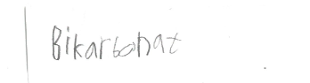
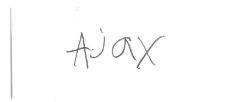
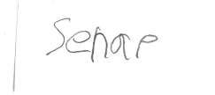
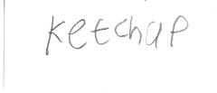
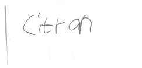
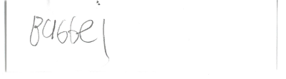
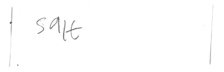

# Surt Eller Basiskt (2023)
## Syfte
Det här testet var för att kolla om ett ämne är surt eller basiskt.
## Material
### Indikator
- BTB
### Ämnen
 - Ajax Fönsterputs
 - Citron Juice
 - Bubbelvatten
 - Ketchup
 - Senap
 - Bikarbonat
 - Salt
 - Sköljmedel
## Hypotes
Jag tror att den som är mest basiskt är sköljmedlet och den som är mest sur är citronjuicen.
## Genomförande
Blanda ett ämne med vatten och häll 3 droppar [BTB](#indikator) i det.
## Resultat
### 
<iframe width="560" height="315" src="https://www.youtube.com/embed/SmgqnRbqB4c" title="YouTube video player" frameborder="0" allow="accelerometer; autoplay; clipboard-write; encrypted-media; gyroscope; picture-in-picture; web-share" allowfullscreen></iframe>

Bikarbonatet blev blått (ca 12 pH)
### 
<iframe width="560" height="315" src="https://www.youtube.com/embed/Dj7amS-d6G0" title="YouTube video player" frameborder="0" allow="accelerometer; autoplay; clipboard-write; encrypted-media; gyroscope; picture-in-picture; web-share" allowfullscreen></iframe>

Sköljmedelet blev gult (ca 3 pH)
### 
<iframe width="560" height="315" src="https://www.youtube.com/embed/GGHyOuF0qTU" title="YouTube video player" frameborder="0" allow="accelerometer; autoplay; clipboard-write; encrypted-media; gyroscope; picture-in-picture; web-share" allowfullscreen></iframe>

Fönsterputset blev blått (ca 14 pH)
### 
<iframe width="560" height="315" src="https://www.youtube.com/embed/LwUD-hHsvNw" title="YouTube video player" frameborder="0" allow="accelerometer; autoplay; clipboard-write; encrypted-media; gyroscope; picture-in-picture; web-share" allowfullscreen></iframe>

Senapen blev gult (ca 3 pH)
### 
<iframe width="560" height="315" src="https://www.youtube.com/embed/608jUB_y7RQ" title="YouTube video player" frameborder="0" allow="accelerometer; autoplay; clipboard-write; encrypted-media; gyroscope; picture-in-picture; web-share" allowfullscreen></iframe>

Ketchupen blev röd (ca 0 pH)
Jag tror detta är väldigt fel.
### 
<iframe width="560" height="315" src="https://www.youtube.com/embed/x97_kLUP22E" title="YouTube video player" frameborder="0" allow="accelerometer; autoplay; clipboard-write; encrypted-media; gyroscope; picture-in-picture; web-share" allowfullscreen></iframe>

Citron Juicen blev gul (ca 3 pH)
### 
<iframe width="560" height="315" src="https://www.youtube.com/embed/WK9vIx0K858" title="YouTube video player" frameborder="0" allow="accelerometer; autoplay; clipboard-write; encrypted-media; gyroscope; picture-in-picture; web-share" allowfullscreen></iframe>

Bubbelvattnet blev gult (ca 3 pH)
### 
<iframe width="560" height="315" src="https://www.youtube.com/embed/9w1xBiWr8Uw" title="YouTube video player" frameborder="0" allow="accelerometer; autoplay; clipboard-write; encrypted-media; gyroscope; picture-in-picture; web-share" allowfullscreen></iframe>

Saltet blev blått (ca 9,9755 pH)
## Slutsats
Jag kom fram till att [ketchupen](#ketchup) var mest sur och [fönsterputsen](#ajax-fönsterputs) var mest basisk.
## Reflektion
Jag tror att resultaten är lite fel (specielt [ketchupen](#ketchup)) för jag råkade ta för mycket [BTB](#indikator) ibland.
## Extra
- [Instruktioner](assets/SurBas23/instruktioner%20labb%202023.pdf)
- [Anteckningar](assets/SurBas23/anteckningar%20labb%202023.pdf)