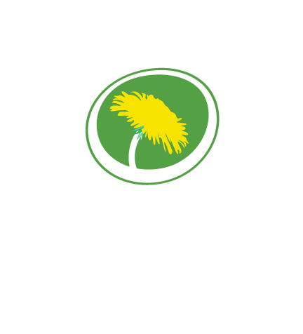

# Miljöpartiet

## Språkrör
Namn: [Märta Stenevi](https://sv.wikipedia.org/wiki/M%C3%A4rta_Stenevi) och [Pär Bolund](https://sv.wikipedia.org/wiki/Per_Bolund)

Sedan: Januari 2021

## Symboler
Blomma: [Maskros](https://sv.wikipedia.org/wiki/Maskrossl%C3%A4ktet)

Förkortning: MP

## Ideologi
- [Grön ideologi](https://sv.wikipedia.org/wiki/Gr%C3%B6n_ideologi)
- [Ekologism](https://sv.wikipedia.org/wiki/Ekologism)
- [Femenism](https://sv.wikipedia.org/wiki/Feminism)

## Värdeord
- Framtiden
- Omställning
- Solidaritet

### [Gå Tillbaka](index)
