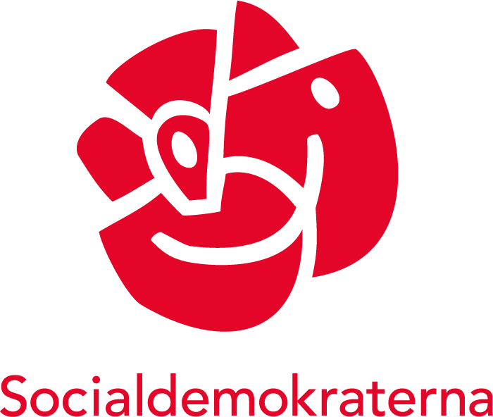

# Socialdemokraterna

## Partiledare
Namn: [Magdalena Andersson](https://sv.wikipedia.org/wiki/Magdalena_Andersson)

Sedan: 4 november 2021

## Symboler
Blomma: [Röd Ros](https://sv.wikipedia.org/wiki/Rossl%C3%A4ktet)

Förkortning: S

## Ideologi
- [Demokratisk socialism](https://sv.wikipedia.org/wiki/Demokratisk_socialism)
- [Socialdemokrati](https://sv.wikipedia.org/wiki/Socialdemokrati)
- [Feminism](https://sv.wikipedia.org/wiki/Feminism)

## Värdeord
- Frihet
- Jämlikhet
- Solidaritet

### [Gå Tillbaka](index)
